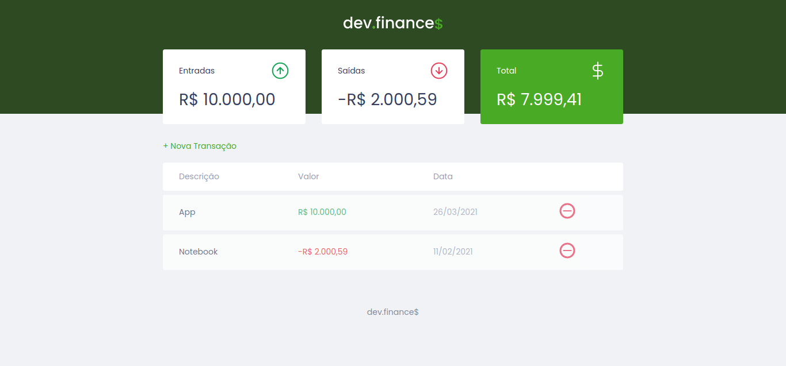
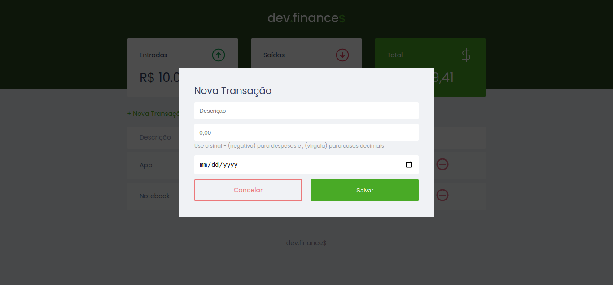

# dev.finance$
> A financial application made with HTML, CSS and JavaScript during the Rocketseat's Discover Marathon!

## Table of contents
* [General info](#general-info)
* [Screenshots](#screenshots)
* [Technologies](#technologies)
* [Setup](#setup)
* [Features](#features)
* [Status](#status)
* [Contact](#contact)

## General info
dev.finance$ is a tool (web application) that allows the user to record incoming and outgoing financial transactions (incomes and expenses), it also to calculate the total value of these transactions.

## Screenshots



## Technologies
* HTML
* CSS
* JavaScript
* localStorage

## Setup

### How to install

```bash
# Clone Repository
$ git clone https://github.com/wjuniori/dev.finance.git

# Go to Project Folder
$ cd dev.finance

# Run Aplication
open the index.html file in your web browser
```

### Demo version

You can acess the demo website at: https://wjuniori.github.io/dev.finance/

## Features
List of features ready:
* Record incoming and outgoing financial transactions (incomes and expenses)
* Calculate the total value of these transactions

## Status
Project is: _finished_.

## Contact
Created and maintained by **[Washington Júnior](https://github.com/wjuniori/)** - feel free to contact me!.
